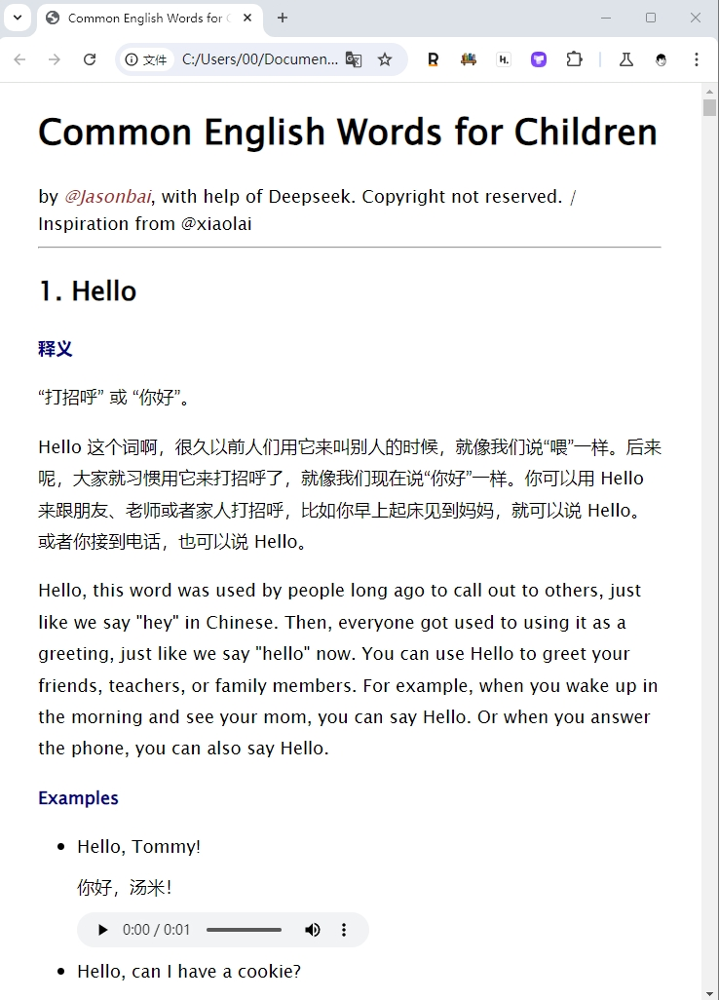

# Common-English-Words-for-Children
 给小朋友的第一本单词书


今天笑来老师发布了他的“**新书**”[《Most Common American Idioms》](https://github.com/xiaolai/most-common-american-idioms)，并且开源了代码 ​。

我的女儿马上二年级，准备教教她英语，之前一直报名的网上课程，我一直觉得商业化的课程设计又傻又慢 ​，但也没办法。这次笑来老师的开源制作书籍的灵感让我连夜制作了一个 ​ **儿童英语入门的版本**。



### 成品效果：

##### 1. 包含300个入门单词 
 > Prompt : 我计划教一个中国儿童，7岁刚接触英语，给我输出一个类似剑桥英语的单词清单，控制在300个常用单词，输出不需要序号
 
##### 2. 生成儿童口语化的介绍
> 示例：Sorry 这个词啊，是用来表达我们做错了事情或者打扰了别人时的心情。就像你打翻了水杯，或者不小心撞到了别人，你就可以说 Sorry。这样别人就会知道你意识到自己的错误，并且感到抱歉。

##### 3. 提供三个儿童容易理解的例句
> Sorry, I broke your toy对不起，我弄坏了你的玩具。

> Sorry, I'm late for school.抱歉，我上学迟到了。

> Sorry, can I pass by?对不起，我可以过去吗？

##### 4. 文字转语音（火山引擎提供），4个少女声随机生成。

我在源码基础上替换了 OpenAI 的接口（因为我没有，且贵），模型基座使用 deepseek效果一致，TTs 文字转语音的部分，接口换成火山引擎的语音接口。接口全部国产化。

deepseek 的模型提示词：

```
def get_base_text(idiom):
  role_definition =
  """
  你是我的儿童英语教练。我将提供一个带有编号的 idiom，你要帮我把他翻译成合适儿童理解的中文释疑。
  而后，讲解一下这个 idiom 的来历=，以及适用的场合，尽量口语化，儿童容易理解。
  再然后，你要为这个 idiom 提供 3 个美式英文例句，尽量使用日常词汇，儿童容易理解，不要过长。
  """

```
火山引擎TTS文字转语音适配版本

```
import base64
import json
import uuid
import requests
import random

# 填写平台申请的appid, access_token以及cluster
appid = "xxx"
access_token= "xxx"
cluster = "xxx"

host = "openspeech.bytedance.com"
api_url = f"https://{host}/api/v1/tts"

header = {"Authorization": f"Bearer;{access_token}"}

def add_zero(number):
    return str(number).zfill(2)

def get_example_sentence_audio(example_sentence, number, order):
    text = example_sentence
    n = add_zero(number)
    
    voice_list = ['BV506_streaming', 'BV702_streaming', 'BV421_streaming', 'BV503_streaming']
    voice_performer = random.choice(voice_list)
    
    speech_file_path = f'audio/{n}.{order}.mp3'
    
    request_json = {
        "app": {
            "appid": appid,
            "token": access_token,
            "cluster": cluster
        },
        "user": {
            "uid": "388808087185088"
        },
        "audio": {
            "voice_type": voice_performer,
            "encoding": "mp3",
            "speed_ratio": 1.0,
            "volume_ratio": 1.0,
            "pitch_ratio": 1.0,
        },
        "request": {
            "reqid": str(uuid.uuid4()),
            "text": text,
            "text_type": "plain",
            "operation": "query",
            "with_frontend": 1,
            "frontend_type": "unitTson"
        }
    }

    try:
        resp = requests.post(api_url, data=json.dumps(request_json), headers=header)
        print(f"resp body: \n{resp.json()}")
        if "data" in resp.json():
            data = resp.json()["data"]
            with open(speech_file_path, "wb") as file_to_save:
                file_to_save.write(base64.b64decode(data))
        print(f'The audio of {n} is saved...')
    except Exception as e:
        print(f"Error: {e}")

# 示例调用
example_list = ['example sentence 1', 'example sentence 2']
for e in example_list:
    get_example_sentence_audio(e.replace("*", ""), 38, example_list.index(e)+1)
```
火山引擎提供的音色不错，试用期2w条免费额度，我选了4个少女声。

其他代码部分完全沿用笑来老师的源码，国产的AI也不慢，整个300个单词制作过程大概1个多小时，花费人民币1块不到。
